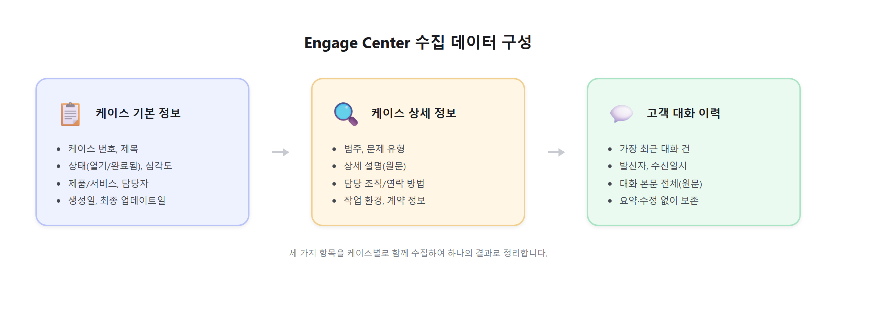
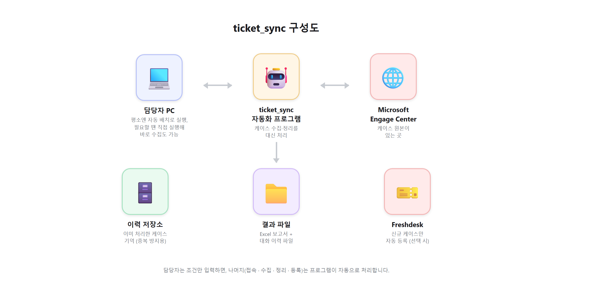

# ticket_sync 소개 (보고용 요약)

> Microsoft Engage Center의 지원 케이스를 자동으로 수집·정리하고, 신규 건에
> 한해 Freshdesk에 등록하는 자동화 프로그램이다.

## 1. 수집 데이터 및 Freshdesk 등록 방식

케이스별로 **기본 정보, 상세 정보, 고객 대화 이력** 세 가지를 함께 수집하여
하나의 결과로 정리한다. 대화 이력은 요약·수정 없이 원문 그대로 보존한다.

신규로 확인된 케이스에 한해 Freshdesk에 티켓으로 등록한다. 등록 시 케이스
번호·제목·상태·심각도·담당자·생성일·상세 설명을 반영하며, 심각도에 따라
우선순위가 자동으로 지정되고 담당 그룹도 사전에 정의된 값으로 배정된다. 이미
등록된 케이스는 판별 후 등록 대상에서 제외하여 중복 등록을 방지한다. 등록 중
일시적 오류가 발생하면 자동으로 재시도하며, 지속적으로 실패하는 케이스는 다음
실행 시 재시도 대상으로 관리한다.

## 2. 구성도

- **담당자 PC**: 평소에는 정해진 시간에 자동 배치로 실행되며, 필요 시 담당자가
  PC에서 직접 실행해 즉시 수집할 수도 있다.
- **자동화 프로그램**이 사람 대신 Engage Center를 조작해 데이터를 수집한다.
- **이력 관리 데이터베이스**가 이미 처리한 케이스를 기록해 중복을 방지한다.
  수집된 케이스 번호를 이 데이터베이스에 먼저 기록해두고, 그 기록과 비교해
  신규 여부를 판단하는 방식이다. 이미 있던 케이스는 최신 정보로 갱신만 하고,
  신규 케이스만 Freshdesk 등록 대상으로 표시한다.
- 최종 결과는 **Excel/대화 이력 파일**로 남고, 필요 시 **Freshdesk**로도
  전달된다.

## 3. 운영 방식과 향후 방향

담당자 PC에서 매번 실행하는 대신, **Kubernetes(K8s)** 에 배포하여 정해진
주기로 자동 실행되도록 운영한다. 최초 1회 담당자가 로그인을 완료하면 이후에는
사람 개입 없이 자동으로 반복 실행되며, 로그인 정보가 만료된 경우에만 담당자가
다시 로그인하면 된다.

프로그램은 이미 처리한 케이스를 기록해 중복 등록을 막기 위해 자체 데이터베이스
(경량 DB)를 사용한다. 이 데이터베이스와 로그인 세션 정보는 Kubernetes의 Pod가
재시작되어도 사라지지 않도록 **영구 저장소(Persistent Volume)** 에 보관하여
운영한다.

**향후 방향성**: 현재는 PC 실행 또는 배치 스케줄을 통해서만 동작을 시작할 수
있다. 다음 단계로 **웹 페이지(UI)를 추가**하여 사용자가 원하는 시점에 조건을
입력해 즉시 동기화를 실행하고, 최근 처리 현황을 화면에서 바로 확인할 수 있는
상시 이용 가능한 형태로 발전시킬 계획이다.

## 정리

사람이 매번 화면을 열어 케이스를 확인하고 옮기던 작업을, 조건만 입력하면
끝까지 자동으로 처리되도록 만든 것이 이 프로그램의 핵심이다. 운영 단계에서는
로그인 정보 관리 외에는 사람 손이 거의 가지 않도록 하고, 이후에는 웹 화면을
통해 누구나 쉽게 사용할 수 있도록 만드는 것을 목표로 한다.
