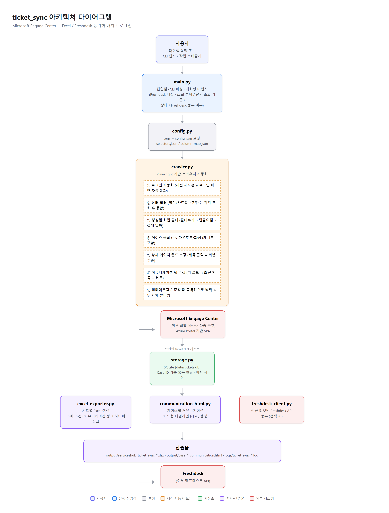

# ticket_sync 설계서

문서 버전: 2026-07-15 (설계서 + 아키텍처 통합본)

## 1. 개요

Microsoft Engage Center의 지원 케이스를 주기적으로 수집해 Excel로 정리하고,
신규 케이스만 Freshdesk에 자동 등록하는 배치 프로그램이다. 상시 구동 서버 없이
실행할 때마다 브라우저(Playwright)를 띄워 동작하는 단일 프로세스 스크립트다.

**제약**: Engage Center는 화면 구조가 자주 바뀌는 SPA이고, 로그인은 MFA 때문에
완전 자동화가 불가능하며, 화면이 여러 iframe으로 중첩되어 있다. 그래서 화면
자동화는 꼭 필요한 곳(로그인 통과, 필터, 상세/커뮤니케이션 열람)에만 최소로
쓰고, 나머지는 CSV·설정 파일 등 안 바뀌는 것에 기대도록 설계했다.

## 2. 아키텍처 다이어그램



| 모듈 | 역할 |
|---|---|
| `main.py` | 진입점. CLI/대화형 입력 처리, 전체 실행 흐름 조율 |
| `config.py` | `.env`/`config.json`/`selectors.json`/`column_map.json` 통합 로딩 |
| `crawler.py` | Playwright 브라우저 자동화 전체 (로그인·필터·목록·상세·커뮤니케이션) |
| `storage.py` | SQLite 저장소. Case ID 기준 신규/중복 판단, 실행 이력 기록 |
| `excel_exporter.py` | 시트별 Excel 생성, 커뮤니케이션 HTML 하이퍼링크 삽입 |
| `communication_html.py` | 케이스별 커뮤니케이션을 카드형 타임라인 HTML로 렌더링 |
| `freshdesk_client.py` | Freshdesk REST API 호출 |
| `config/selectors.json` | 화면 라벨/버튼 문구 모음 (화면 변경 시 여기만 수정) |
| `config/column_map.json` | CSV 헤더 → 내부 필드명 매핑 |

## 3. 실행 방식

**대화형**: `python main.py` — Freshdesk 대상 → 조회 범위(전체/날짜범위/오늘) →
(날짜범위 선택 시) 날짜 조회 기준(만들어짐/업데이트됨) + 시작일 → 케이스 상태
(열기/완료됨/모두) → Freshdesk 등록 여부(Y/N) 순으로 입력받는다.

**비대화형**: `python main.py --freshdesk prod --mode range --date-basis created --start-date 2026-01-01 --case-status open --non-interactive`

| 인자 | 설명 |
|---|---|
| `--freshdesk {prod,test,custom}` | Freshdesk 연결 대상 |
| `--mode {all,range,today}` | 조회 범위 |
| `--start-date`/`--end-date` | 날짜 범위 (종료일 생략 시 오늘) |
| `--date-basis {created,updated}` | 날짜 조회 기준, 기본 created |
| `--case-status {open,closed,all}` | 케이스 상태, 기본 open |
| `--create-freshdesk-ticket {true,false}` | Freshdesk 등록 여부, 기본 false |
| `--headless` / `--non-interactive` / `--config` / `--env-file` | 실행 옵션 |

## 4. 핵심 동작 흐름

```
main.py: 조건 입력/파싱 → config.py 로 설정 로딩
  → crawler.collect_tickets(status, date_basis, ...)

     status="all" 이면 "open" → "closed" 순으로 아래를 두 번 반복 후 Case ID로 병합:

     1) 로그인 확인 (세션 재사용, 필요한 자동 클릭만 통과, 비밀번호/MFA는 사람이 입력)
     2) 상태 필터 적용 ("열기"/"완료됨" 중 하나. 화면에 "모두"가 없어 코드에서 조합)
     3) date_basis="created" 면 화면 날짜 필터(필터추가>만들어짐>절대날짜) 적용
     4) "CSV로 다운로드" → 파싱 → date_basis="updated" 면 "업데이트됨" 값으로 재필터링
     5) 케이스마다: 제목 클릭 → 상세 필드 읽기 → 커뮤니케이션 탭에서 최신 대화 수집
        → HTML 저장 → 목록으로 복귀

  → storage.py: Case ID 기준 신규/중복 판단, DB 반영
  → excel_exporter.py: 조회조건+결과를 시트별 Excel로 저장 (파일 사용 중이면 대체 파일명)
  → freshdesk_client.py: (등록 선택 시) 신규 티켓만 등록
```

주요 항목별 비고:

- **상세 정보**: CSV에 없는 항목(심각도, 인시던트 관리자, 범주 등)만 상세 화면에서
  읽는다. 라벨→필드 매핑은 `selectors.json`(`case_detail.field_labels`)에서 관리.
- **커뮤니케이션**: "더 로드"를 끝까지 눌러 전체 목록을 로드한 뒤, 마지막 업데이트가
  가장 최근인 항목의 본문(스레드 전체)을 그대로 보존해 카드형 HTML로 저장.
- **CSV 다운로드**: 결과가 수천 건(예: "완료됨" 전체)일 때 서버 생성이 느려 실패할
  수 있어 최대 3회 재시도한다.
- **화면 요소 탐색**: 화면이 여러 iframe으로 중첩돼 있고, 필터 팝오버마다 역할
  속성(`role`)이 달라서, 모든 프레임/여러 role을 함께 탐색하는 공통 유틸리티를 쓴다.

## 5. 데이터 모델 (SQLite `tickets` 테이블 주요 필드)

| 필드 | 설명 |
|---|---|
| ms_case_id | Microsoft Case ID (중복 판단 기준) |
| title/status/status_message/severity | 케이스 기본 정보 |
| created_at/modified_at/closed_at | 생성일/업데이트됨/종료일 |
| product/product_family/category/problem_type | 제품/문제 분류 |
| requester/incident_manager/case_owner/contact_method | 담당자/연락처 |
| workspace/country_region/timezone | 작업 환경 |
| contract_id/case_type/tenant_id/subscription_id/tenant | 계약/테넌트 정보 |
| case_url | 상세 화면 실제 URL (방문 시점 캡처) |
| summary / communication_html_path | 상세 설명 / 커뮤니케이션 HTML 경로 |
| freshdesk_status/freshdesk_ticket_id/freshdesk_error | Freshdesk 등록 결과 |

## 6. 주요 설계 결정

| 결정 | 이유 |
|---|---|
| 목록은 화면 대신 **CSV 다운로드**로 받음 | 화면 테이블 구조는 자주 바뀌지만 CSV 형식은 안정적 |
| 화면 라벨/버튼 문구는 **설정 파일**로 분리 | 문구 변경 시 코드 대신 설정만 수정하면 되게 하려고 |
| 상세 페이지는 **URL 추측 대신 클릭 이동** | Azure Portal 해시 라우팅과 URL 추측이 안 맞아 폐기, 클릭 후 실제 URL 캡처로 변경 |
| 상태 "모두"는 **코드에서 두 번 조회 후 병합** | 화면에 옵션 자체가 없고, 체크박스 동시 적용은 상세 조회 로직과 충돌해 폐기 |
| 재시도는 **일시적 문제에만** 적용 | 서버 지연은 재시도로 해결되지만, 화면 구조 차이는 재시도해도 동일하게 실패해 경고 후 스킵 |

## 7. 확장 포인트

| 바뀌는 것 | 고칠 곳 |
|---|---|
| 상세 화면에 새 항목 추가 | `config/selectors.json` → `case_detail.field_labels` |
| CSV 헤더 이름 변경 | `config/column_map.json` |
| Freshdesk 연결 대상 추가 | `config.json` → `freshdesk_environments` |

모두 코드 수정 없이 설정 파일만 고치면 된다.

## 8. 알려진 제약/이슈

- **대용량 CSV 지연**: "완료됨" 등 날짜로 못 좁히는 수천 건 조회 시 서버 쪽 CSV 생성이
  간헐적으로 지연/실패할 수 있음 (재시도 3회로도 완전히 해소되지는 않음).
- **캘린더 연도 이동**: 생성일 필터에서 시작일이 다른 연도인 경우의 동작은 충분히
  검증되지 않음.
- **화면 구조 변경 대응**: 라벨/문구 변경은 설정 파일로 대응 가능하나, 팝오버 role
  속성처럼 근본적인 레이아웃 변경은 코드 수정이 필요할 수 있음.
